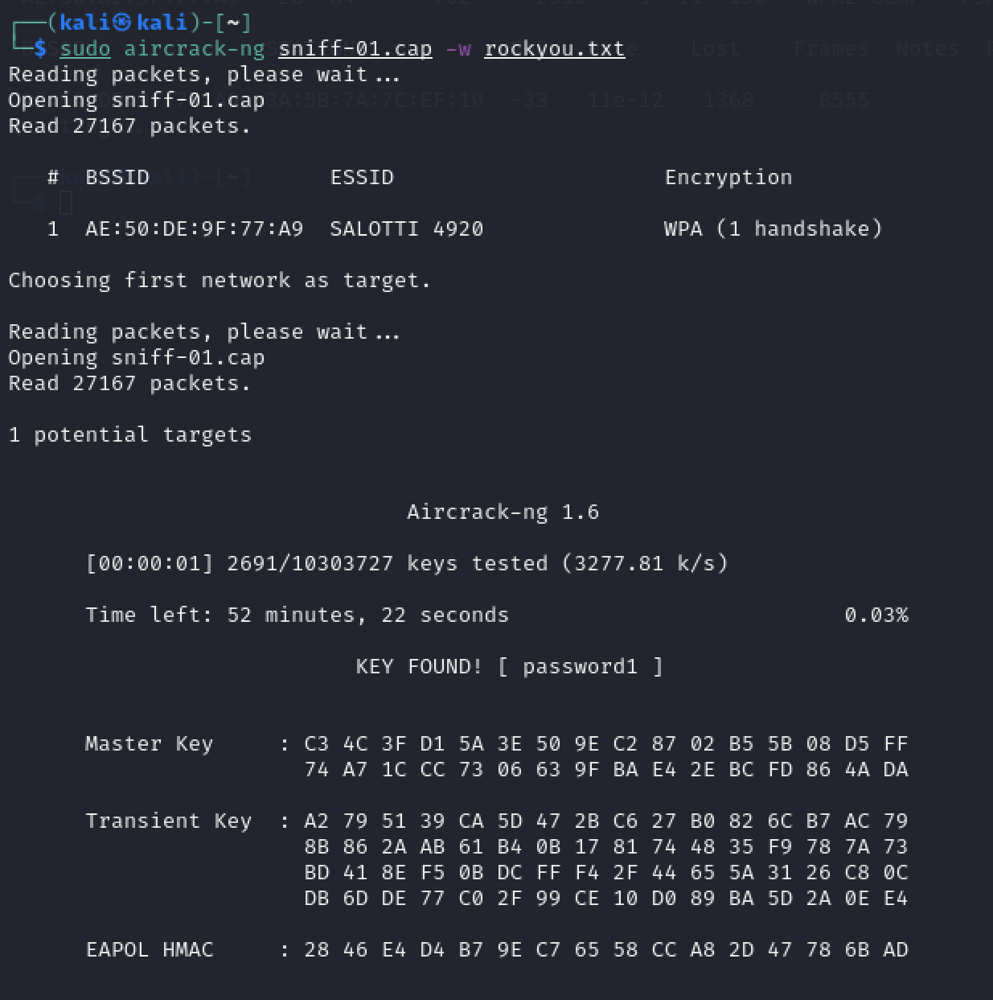

# Wifi Deauth Attack

## Abstract

**Initial State:** A Client is connected to a ***password Securised Wifi***

The goal is to get the wifi password.  
To acheivied it:  
1) Detect WiFi
2) Detect connected computer to this WiFi
3) Send a huge quantity of package to this computer to make it disconnect from the WiFi
4) Get Password Hash when it try to reconnect to WiFi
5) BrutForce it :)

## Network Package Structure

On each network package there are source & destination address.
By default, WiFi Card filters only package that have its Ip as destination address. That's a security layer often added in driver, so that's hard to bypass.

So how to bypass ?
>Buy a new WiFi Card with Monitor Mode capability that you can plug to your computer by USB. (Monitor Mode is the ability to get and read not destinated package).

I bought & used AWUS1900.

WiFi card will be considered as fully configured & driver installed for the following of this tutorial.

Use this GitHub to install driver for AWUS1900: https://github.com/morrownr/8814au/blob/main/README.md

You will also have to install aircrack-ng on your linux.
## Step 1: Enable Monitor Mode
By default, your card is in Managed Mode (filter by destination address mode). You have to tell him to get and read every package.

First get your card interface name:
>iwconfig

**Interface name is often wlan0 or wlan1**  
Then turn Monitor Mode on.  

>sudo airmon-ng interface_name

***Interface name can change to < interface_name >mon. You Check it with iwconfig***
## Step 2: Detect WiFi

>sudo airodump-ng interface_name  

This will detect WiFi Network. Each Network is associated with a station address (the rooter).

Note the BSSID (MAC address of an access point) of the Netwok you want.
Note also the channel used.

## Step 3: Detect Computer Connected

Then, We just add a filter to filter by source or destination equal access point MAC address

>sudo airodump-ng -c channel --bssid mac_bssid

Here we can see connected computer(s)

Choose the one you want to hack and note the station mac address.

## Step 4: Listen Network while Deauth Attack To Victim

We will perform a deauth attack to the victim's station. The goal is to make the station's WiFi Card restart and reconnect to network. So the station will send authentification package to access point with network password hash inside. **That's this package we wanna catch.**

We will do that with 2 commands:  
- listen and write in a file all authentification package catch threw this network.
> sudo airodump-ng -c channel --bssid mac_bssid -w outfilename interface_name 

- attack victim to make it deauth.  
***We want to deauth victim while listening and writing network auth package when victim try to reconnect to his network => open a new terminal to perform attack***
> sudo aireplay-ng -0 1 -a  mac_bssid -c station_mac_address interface_name

## Step 5: Checking EAPOL package received

If deauthentification and reauthentification forced worked, we should have received EAPOL package. In listing package terminal window, there's EAPOL written in package received.

Deauth worked most of the time but immediate reauthentification doesn't always work. Indeed, Mac OS does not reconnect immediatly to previously reconnected Network after WiFi card unplanned restart. Windows OS doesn't follow the rule and try to reconnect instantly. (Prefer Windows Station to deauth if you have the choice ;))

Then, if it works stop the listening we have what we want by Ctrl+C over listening terminal.

## Step 6: Retreiving WiFi password

A new file was created, you can check it easlily with
>ls

### Time to Brutforce

We will perform here a dictionnary attack.
Choose your dictionnary, **rockyou.txt** by default.

>sudo aircrack-ng -w rockyou.txt outfile.cap

## Conclusion

The harder thing to do is to force victim to reconnect. Sometime, victim OS does not reconnect automatically.  

Use stenght password to protect your WiFi or use WPA3 protocol (hash function harder to calculate => lower hash rate)

It makes brutforce method less efficient
